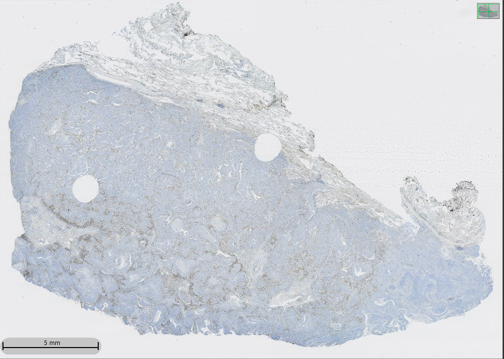
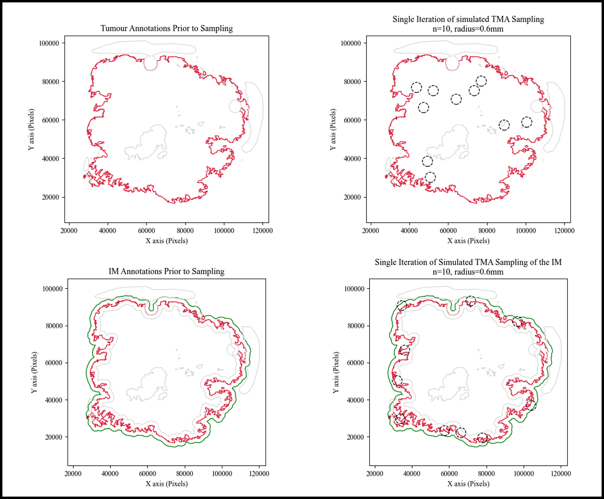

# 
 Whole-Slide vs TMA Sampling 

#### 
 The contained code was developed to analyze whole-slide IHC data exported from HALO (Indica Labs) 

#### 
Contact: 16mrf6@queensu.ca

  
  ## 1. Description
This is the description.

  ### 1.1. Functions
  #### 1.1.1. load_sim_data
  
  #### 1.1.2. n_core_sampler

  
  #### 1.1.3. eta_counter
  
  #### 1.1.4. compute_hpfs
  
  #### 1.1.5. sample_hpfs
  
  #### 1.1.6. hpf_density_histograms
  
## 2. Instructions
### 2.1. Python Instructions
#### 2.1.1. Environment setup
These are the instructions.
